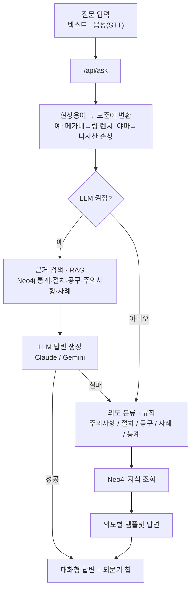
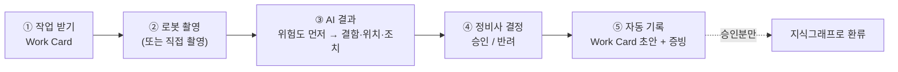
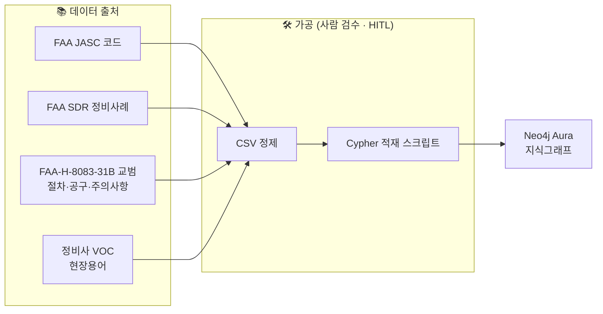
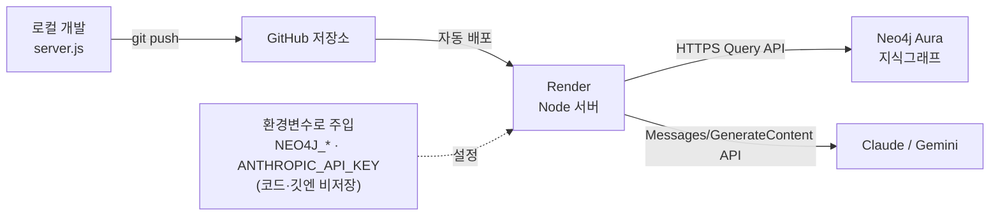

# MRO Copilot — 시스템 아키텍처

항공정비 Physical AI 오케스트레이션 PoC. 정비사가 **찾고·촬영하고·기록하는 시간**을 줄여 바로 정비에 집중하게 하는 서비스.

> 설계 원칙
> - 최종 결함 **판정은 정비사**가 한다. AI는 판정하지 않고 정보만 제공한다 (HITL).
> - AI 생성 기록은 **정비사 승인 후에만** 지식으로 환류된다.
> - 기존 시스템(ERP·Work Card 등)을 **대체하지 않고 연결**한다.
> - LLM은 **교체 가능한 부품**이다. 지식(Neo4j)·규칙은 그대로 두고 LLM만 얹거나 뺀다.

---

## 1. 전체 아키텍처

```mermaid
flowchart TB
  subgraph U["👷 사용자"]
    tech["정비사"]
    mgr["관리자"]
  end

  subgraph FE["🖥️ 프론트엔드 (브라우저)"]
    app["index.html<br/>정비사 작업 앱 · 5단계"]
    orch["orchestration.html<br/>오케스트레이션 · 별첨"]
    hud["robot.html<br/>로봇 검사 HUD"]
  end

  subgraph BE["☁️ 백엔드 · Node 서버 (Render 호스팅)"]
    api["HTTP API<br/>/api/ask · /api/query · /api/parts<br/>/api/workflow · /api/robot"]
    norm["현장용어 정규화<br/>현장용어사전.csv"]
    proc["질의 처리<br/>RAG · 규칙 기반"]
  end

  subgraph KG["🗄️ 지식그래프 · Neo4j Aura"]
    graph["Part · Defect · Procedure · Step<br/>Tool · SafetyWarning · ExternalCase<br/>WorkOrder · InspectionLocation ...<br/>(1,365 노드 / 2,582 관계)"]
  end

  subgraph LLM["🤖 외부 LLM · 교체 가능"]
    claude["Claude (Anthropic)"]
    gemini["Gemini (Google)"]
  end

  tech --> app
  mgr --> app
  app --> api
  orch --> api
  hud --> api

  api --> norm --> proc
  proc -->|지식 조회| graph
  proc -->|근거 기반 생성| claude
  proc -. 대체 provider .-> gemini
  claude -->|답변| api
```

---

## 2. 챗봇 질의 흐름 — "안 갈아엎고 얹기"

의도 파악 → 지식 조회 → 답변 생성의 3단계 구조. **LLM은 ①③만 대체**하고, **②(Neo4j 지식 조회)는 그대로**. LLM이 꺼져 있거나 실패하면 **규칙 기반으로 자동 fallback**(데모 안전장치).



---

## 3. 정비사 작업 흐름 (index.html · 5단계)

로봇이 사각지대를 촬영하고 AI가 이상 지점을 찾되, **결정은 정비사**가 한다.



---

## 4. 지식 적재 파이프라인 (오프라인 · 1회성)

공개 표준·사례·교범과 현장 VOC를 정제해 온톨로지 인스턴스로 적재.



---

## 5. 배포 파이프라인



---

## 구성요소 요약

| 계층 | 구성 | 역할 |
|---|---|---|
| 프론트엔드 | index / orchestration / robot (.html) | 정비사 작업 앱, 오케스트레이션(별첨), 로봇 HUD |
| 백엔드 | `server.js` (Node 내장 http/https, 무의존성) | API 라우팅, 현장어 정규화, RAG·규칙 처리 |
| 지식 | Neo4j Aura | 정비 온톨로지 그래프 (부품·결함·절차·공구·사례) |
| LLM | Claude / Gemini (환경변수로 선택) | 자유질문·추론·현장어 대응 (근거 기반, 환각 억제) |
| 배포 | GitHub → Render, Neo4j Aura | push 시 자동 배포, 지식 DB는 클라우드 분리 |

> 비밀정보(DB 비번·API 키)는 **환경변수로만** 주입하며 코드·깃에 저장하지 않는다.
