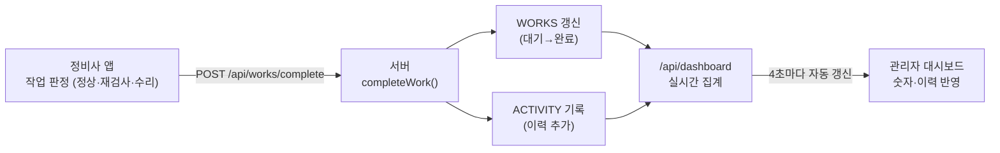

# 정비사 앱 ↔ 관리자 대시보드 실시간 연동 정리본

> **한 줄 요약:** 정비사가 현장에서 작업을 판정하면 → 그 결과가 서버에 반영되고 → 관리자 대시보드의 숫자·이력이 실시간으로 갱신된다.
> "현장 작업이 곧바로 경영 지표로 연결되는" 흐름을 구현·검증했다.

---

## 1. 정비사 앱 — 수정 전 → 후

### 무엇이 바뀌었나

| 항목 | 수정 전 | 수정 후 |
|---|---|---|
| **첫 화면** | 작업 **1건**만 고정 표시 (사각지대 외관검사) | **오늘의 작업 목록 5건** (위험도·부위별 카드) |
| **작업 선택** | 없음 (단일 작업) | 목록에서 **원하는 작업 선택** → 그 작업 정보로 5단계 진행 |
| **판정 결과** | 화면에만 표시, 서버 전송 없음 | **판정 시 서버로 전송** (`POST /api/works/complete`) |
| **관리자 연결** | 없음 | 완료 화면·목록에 **"📊 관리자 대시보드 보기"** 버튼 |
| **작업 데이터** | `/api/workflow` 단일 WO 하드코딩 | `/api/works` 로 **여러 작업 로드**, 선택 작업(`CURWORK`) 기준으로 흐름 구성 |
| **AI 결과** | 항상 부식(CORRODED) 고정 | 선택 작업의 결함에 맞게 매핑 (균열→CRACKED 등) |

### 유지된 5단계 흐름 (작업 선택 후)

```
작업 목록 → [작업 선택] → ① 작업 받기 → ② 로봇/직접 촬영 → ③ AI 결과
         → ④ 정비사 판정(정상·재검사·수리) → ⑤ 자동 기록 + 서버 반영
```

- 판정 순간 `POST /api/works/complete {id, capturedBy, verdict}` 전송
- 완료 화면에 **"관리자 대시보드에 실시간 반영됨"** 문구 + 목록 복귀 버튼

> 이번 세션에서 챗봇도 함께 개선됨: **대화 기억**(이전 질문 맥락 유지) + **자연스러운 어투**(Gemini) + 시트 하단 **이어질문 입력창**.

---

## 2. 관리자 대시보드 — 어떻게 만들었나

### 화면 구조 (기술 용어 ZERO, 판단 중심)

| 밴드 | 내용 |
|---|---|
| **🔺 HERO — 기대효과 4대 지표** | 작업 효율(리드타임↓) · 정비 품질(완결률) · 경제 효과(회수 1,040h→3,100~4,000만원) · 역량 향상(신입–숙련 격차↓) |
| **🗂️ 오늘 현황** | 오늘 작업 / 완료 / 대기 / 🔴긴급 / ⚠지연 · 결함·재검사·로봇활용·승인대기 |
| **🚧 병목** | 검사 대기 · 승인 대기 · 재검사 + 결함 Top3 |
| **⚠ 알림** | 긴급·지연 작업만 콕 (문제만) |
| **🧾 오늘 활동 이력** | 정비사 작업이 시간순으로 축적 (실시간) |
| **📊 추이** | 리드타임·품질 변화 곡선 (시뮬) |

### 데이터 3층 (정직한 라벨링)

| 층 | 예 | 라벨 |
|---|---|---|
| **실측** | 완료·대기 수, 리드타임 단축률, 품질 완결률 | 시연 작업에서 실제 집계 |
| **시뮬** | 주간 추세 곡선 | 추세 예시 |
| **검증 목표** | 경제효과(금액), 역량 향상 | PoC로 검증할 목표치 |

+ **실데이터(Neo4j)**: 하단에 누적 정비지식 사례 수·부품 종 수

### 핵심 구현

- 서버에 **라이브 공유 상태** `WORKS`(오늘의 작업) + `ACTIVITY`(활동 이력) 보유
- `buildDashboard()`가 `WORKS`를 **매 요청마다 실제 집계** → 하드코딩 아님
- 화면은 **4초마다 자동 갱신**(`setInterval`) → 정비사 작업이 실시간으로 반영
- 값 하나가 아니라 **전 → 후 → 목표** 로 표시 (효과가 델타로 보이게)

---

## 3. 반영 흐름 검증

### 흐름도



### 연결 API 3종

| API | 역할 |
|---|---|
| `GET /api/works` | 오늘의 작업 목록 (정비사 앱 첫 화면) |
| `POST /api/works/complete` | 정비사 판정 → 작업 완료 처리 + 이력 기록 |
| `GET /api/dashboard` | 라이브 집계 + 활동 이력 (관리자 대시보드) |

### 검증 결과 (판정 1건 → 대시보드 반영)

**시나리오:** W-234(SKIN 부식) 을 정비사가 **'수리'** 로 판정 → 대시보드 변화 측정

| 지표 | 판정 전 | 판정 후 | 변화 |
|---|---|---|---|
| 완료 | 3 | **4** | +1 ✅ |
| 대기 | 5 | **4** | −1 ✅ |
| 승인 대기 | 2 | **3** | +1 (수리는 승인 필요) ✅ |
| 이력 최신 | PANEL 정상 | **SKIN 부식 → 수리 (로봇 촬영)** | 새 항목 최상단 ✅ |

**결론:** 정비사 판정이 서버 상태(`WORKS`·`ACTIVITY`)를 갱신하고, 관리자 대시보드가 이를 즉시 집계·표시함을 **API 레벨에서 검증 완료.**

---

## 부록. 관련 파일·상태

| 구분 | 위치 |
|---|---|
| 정비사 앱 | `index.html` (작업 목록·5단계·판정 전송) |
| 관리자 대시보드 | `manager.html` (HERO·운영·이력·자동갱신) |
| 서버 | `server.js` — `WORKS`/`ACTIVITY` 라이브 상태, `completeWork()`, `buildDashboard()`, 3개 API |

> **시연 데이터 안내:** 오늘의 작업(8건 중 시연 대기 5건)은 **PoC 시연용 시드 데이터**이며, 각 지표는 실측/시뮬/검증목표로 라벨링됨. 리드타임·완결률 등은 배포 시 작업 타임스탬프·Work Card·로봇 로그에서 자동 수집됨.
